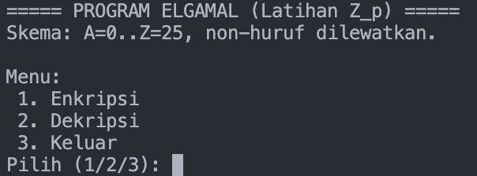
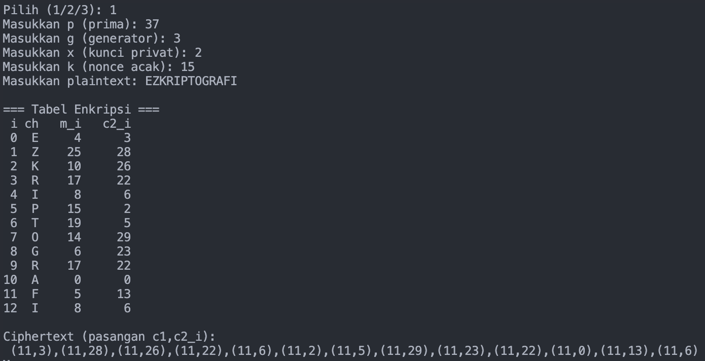
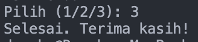

# ElGamal Cipher Program

## Identitas
- **Nama** : Dzacky Ahmad  
- **NPM**  : 140810230043  

## Deskripsi Program
Program ini adalah implementasi **ElGamal Cipher** dalam bahasa Python dengan dua fitur utama:

1. **Enkripsi**  
   - User memasukkan parameter:
     - `p` (bilangan prima),
     - `g` (generator),
     - `x` (kunci privat),
     - `k` (bilangan acak/nonce),
     - serta `plaintext`.  
   - Program menghitung kunci publik:  
     \[
     y = g^x \bmod p
     \]  
   - Program menghasilkan ciphertext berupa pasangan \((c1, c2_i)\) untuk setiap karakter.

2. **Dekripsi**  
   - User memasukkan ciphertext (`c1` dan daftar `c2`), kunci privat `x`, serta nilai `p`.  
   - Program menghitung kembali shared secret:  
     \[
     s = c1^x \bmod p
     \]  
     lalu mencari invers modular \(s^{-1}\).  
   - Plaintext dikembalikan dengan rumus:  
     \[
     m_i = c2_i \cdot s^{-1} \bmod p
     \]  

## Alur Program
1. Program menampilkan menu utama:

===== PROGRAM ELGAMAL (Latihan Z_p) =====\n
Enkripsi\n
Dekripsi\n
Keluar\n
2. User memilih menu (1, 2, atau 3).  
3. Jika memilih **Enkripsi**, user memasukkan parameter `p`, `g`, `x`, `k`, dan `plaintext`. Program akan menampilkan nilai `y`, `c1`, `s`, serta daftar `c2`.  
4. Jika memilih **Dekripsi**, user memasukkan parameter `p`, `x`, `c1`, template teks (untuk kapitalisasi & non-huruf), serta daftar `c2`. Program akan menampilkan hasil plaintext.  
5. Hasil enkripsi atau dekripsi ditampilkan di layar.  

## Screenshots
### Menu Utama


### Enkripsi


### Dekripsi


### Keluar


## Catatan
- Program ini hanya versi **latihan akademik** dengan modulus kecil (contoh: p=37).  
- Untuk keamanan nyata, ElGamal memerlukan bilangan prima yang jauh lebih besar (ratusan atau ribuan bit) dan nonce `k` yang berbeda tiap pesan.  
- Jalankan dengan perintah:
```bash
python elgamal.py
