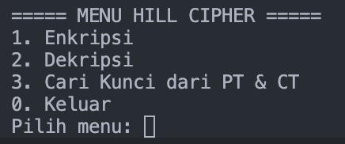
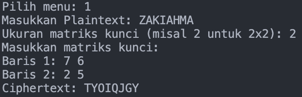
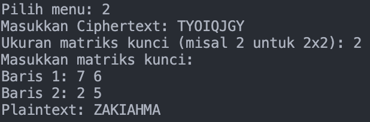
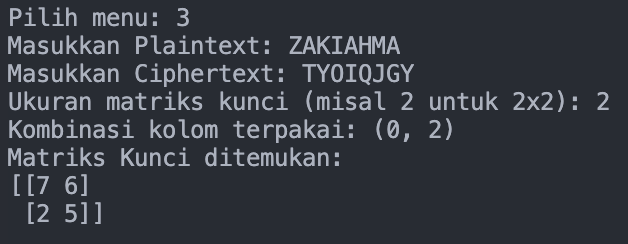

# Hill Cipher Program

## Identitas
- **Nama** : Dzacky Ahmad  
- **NPM**  : 140810230043  

## Deskripsi Program
Program ini adalah implementasi **Hill Cipher** dalam bahasa Python dengan tiga fitur utama:
1. **Enkripsi**  
   - User memasukkan plaintext dan matriks kunci.  
   - Program membagi plaintext menjadi blok sesuai ukuran kunci, mengalikan dengan matriks kunci, dan hasilnya menjadi ciphertext.  

2. **Dekripsi**  
   - User memasukkan ciphertext dan matriks kunci.  
   - Program menghitung determinan matriks kunci, mencari invers modulo 26, lalu menghitung invers matriks kunci.  
   - Ciphertext dikalikan dengan invers matriks untuk mendapatkan kembali plaintext.  

3. **Cari Kunci dari Plaintext & Ciphertext**  
   - User memasukkan pasangan plaintext dan ciphertext dengan panjang minimal n² huruf (untuk kunci n×n).  
   - Program membentuk matriks plaintext dan ciphertext, mencari submatriks invertible, lalu menghitung kunci Hill Cipher dengan rumus:  
     K ≡ C · P⁻¹ (mod 26)

## Alur Program
1. Program menampilkan menu utama:
   ```
   ===== MENU HILL CIPHER =====
   1. Enkripsi
   2. Dekripsi
   3. Cari Kunci dari PT & CT
   0. Keluar
   ```
2. User memilih menu (1, 2, atau 3).  
3. Program meminta input sesuai pilihan (plaintext, ciphertext, atau keduanya, serta matriks kunci).  
4. Program melakukan proses perhitungan sesuai metode Hill Cipher.  
5. Hasil (ciphertext, plaintext, atau matriks kunci) ditampilkan di layar.  

## Screenshots
### Menu Utama


### Enkripsi


### Dekripsi


### Cari Kunci


## Catatan
- Program membutuhkan library `numpy`.  
- Jalankan dengan perintah:
  ```bash
  python HillCipher.py
  ```
- Pastikan input plaintext/ciphertext panjangnya sesuai dengan ukuran kunci.
