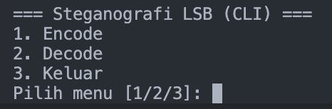
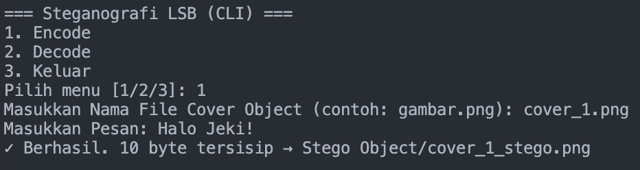
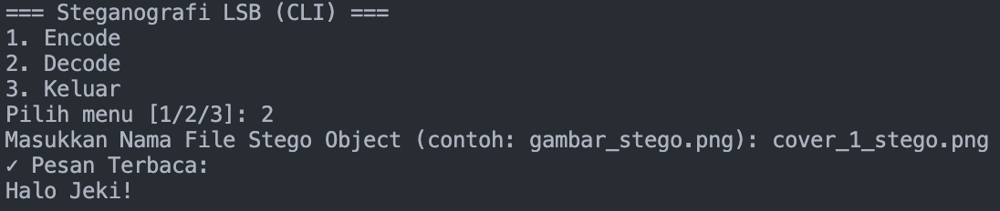

# Steganografi LSB

## Identitas
- **Nama** : Dzacky Ahmad  
- **NPM**  : 140810230043  

## Deskripsi Program
Program ini adalah implementasi **Steganografi LSB (Least Significant Bit)** pada gambar **RGB** menggunakan bahasa Python. Program dapat **menyembunyikan pesan teks** ke dalam gambar (Encode) dan **mengambil kembali pesan tersembunyi** dari gambar stego (Decode).  

Teknik LSB bekerja dengan cara memodifikasi bit paling tidak signifikan dari channel warna (R, G, B) sehingga perubahan tidak terlihat secara kasat mata, namun tetap mampu menyimpan data pesan.

---

## Fitur Utama
1. **Encode**
   - User memilih file gambar cover dari folder `Cover Object/`.
   - User memasukkan pesan teks.
   - Program menyisipkan pesan ke dalam LSB gambar dan menyimpannya ke folder `Stego Object/` dengan nama `<nama_file>_stego.png`.

2. **Decode**
   - User memilih file gambar stego dari folder `Stego Object/`.
   - Program mengekstrak dan menampilkan pesan yang disembunyikan.

3. **Keluar**
   - Menutup program.

---

## Alur Program
1. Saat dijalankan, program menampilkan menu utama:

```
=== Steganografi LSB (CLI) ===
1. Encode
2. Decode
3. Keluar
```

2. Jika memilih **Encode**:
   - User diminta memasukkan nama file dari folder `Cover Object/`.
   - User diminta memasukkan pesan.
   - Program menyimpan hasil stego ke folder `Stego Object/`.

3. Jika memilih **Decode**:
   - User diminta memasukkan nama file dari folder `Stego Object/`.
   - Program menampilkan pesan yang berhasil diekstrak.

4. Jika memilih **Keluar**, program berhenti.

---

## Struktur Folder
```
Steganography/
│── Cover Object/     # folder input gambar cover
│── Stego Object/     # folder hasil encode
│── LSB.py            # file program utama
│── README.md         # dokumentasi
```

---

## Cara Menjalankan
1. Pastikan sudah menginstall **Pillow**:
   ```bash
   pip install pillow
   ```

2. Jalankan program:
   ```bash
   python LSB.py
   ```

3. Ikuti menu interaktif:
   - Pilih `1` untuk Encode.
   - Pilih `2` untuk Decode.
   - Pilih `3` untuk Keluar.

---

## Screenshots (opsional)
### Menu Utama


### Encode


### Decode


---

## Catatan
- Hanya mendukung **format gambar lossless** (PNG/BMP).  
- Kapasitas pesan terbatas oleh ukuran gambar:  
  \[
  \text{maksimal bytes} \approx \frac{(lebar \times tinggi \times 3 - 32)}{8}
  \]  
- Program ini dibuat untuk tujuan **pembelajaran akademik**. Untuk aplikasi nyata, metode steganografi perlu dikombinasikan dengan kriptografi agar lebih aman.
