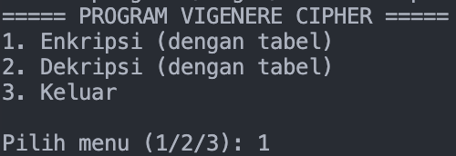
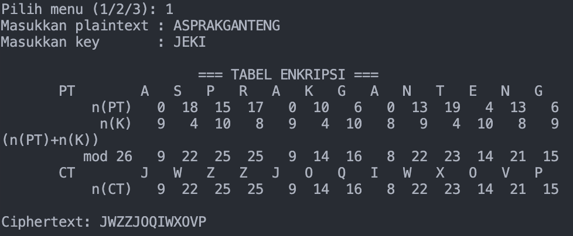
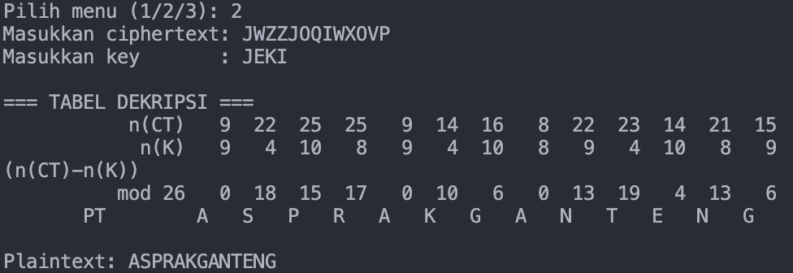
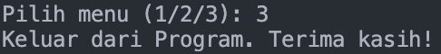

# Vigenere Cipher Program

## Identitas
- **Nama** : Dzacky Ahmad  
- **NPM**  : 140810230043  

## Deskripsi Program
Program ini adalah implementasi **Vigenère Cipher** dalam bahasa Python dengan dua fitur utama:

1. **Enkripsi**  
   - User memasukkan plaintext dan key.  
   - Program otomatis menyesuaikan panjang key dengan plaintext.  
   - Plaintext diubah menjadi ciphertext menggunakan rumus:  
     \[
     C_i = (P_i + K_i) \bmod 26
     \]  

2. **Dekripsi**  
   - User memasukkan ciphertext dan key.  
   - Program menyesuaikan panjang key dengan ciphertext.  
   - Ciphertext dikembalikan menjadi plaintext menggunakan rumus:  
     \[
     P_i = (C_i - K_i) \bmod 26
     \]  

## Alur Program
1. Program menampilkan menu utama:
   ```
   ===== PROGRAM VIGENERE CIPHER =====
   1. Enkripsi
   2. Dekripsi
   3. Keluar
   ```
2. User memilih menu (1, 2, atau 3).  
3. Jika memilih **Enkripsi**, user memasukkan plaintext dan key → program menampilkan hasil ciphertext.  
4. Jika memilih **Dekripsi**, user memasukkan ciphertext dan key → program menampilkan hasil plaintext.  
5. Proses berulang sampai user memilih keluar.  

## Screenshots
### Menu Utama


### Enkripsi


### Dekripsi


### Keluar


## Catatan
- Program tidak membutuhkan library eksternal (cukup Python standar).  
- Jalankan dengan perintah:
  ```bash
  python vigenere.py
  ```
- Input huruf dapat berupa huruf besar atau kecil. Karakter non-huruf (spasi, tanda baca) tidak diubah.
